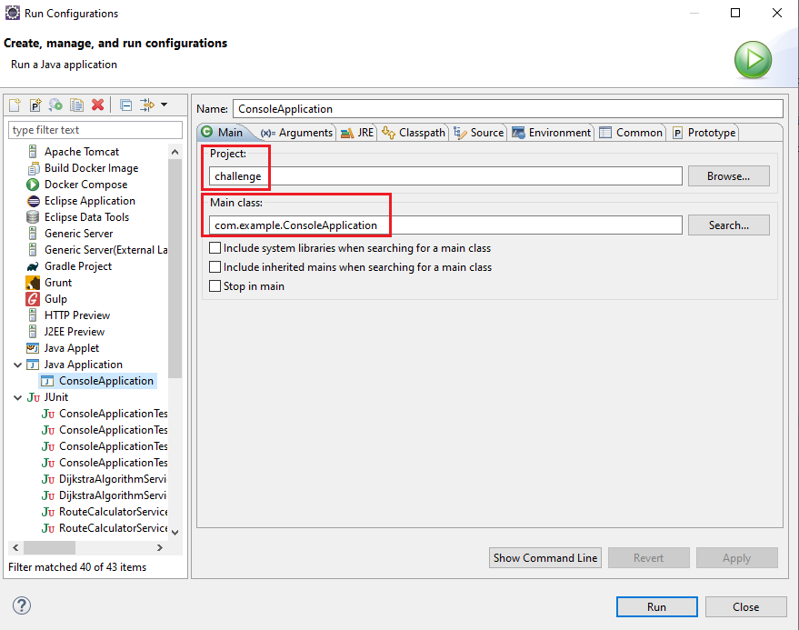
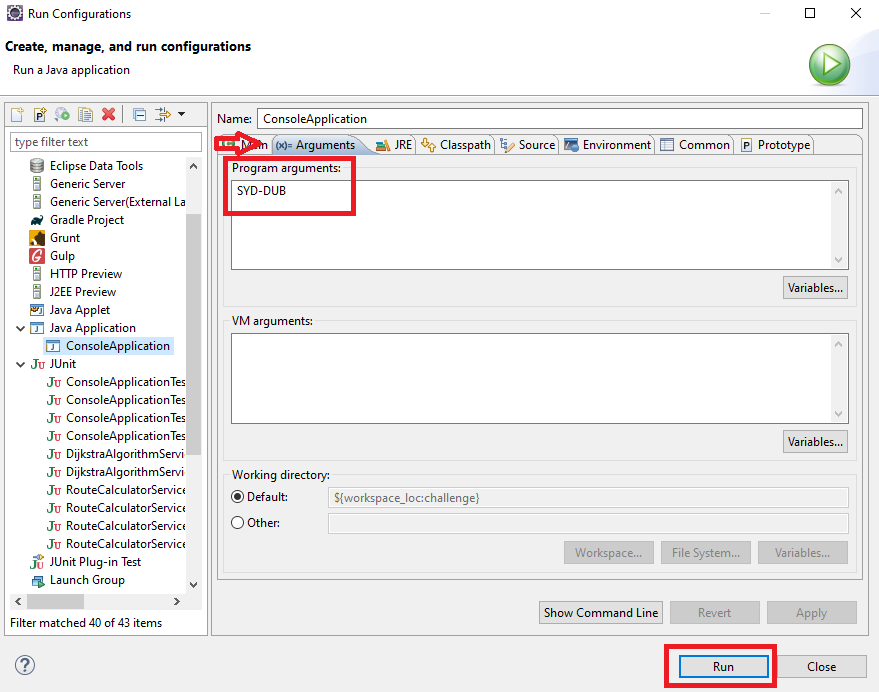

# CODE CHALLENGE APPLICATION
### DESCRIPTION
The program consist on, given a table of Departure and Arrival airports, calculate the shortest route that a airplane must take.
This is a shortest path problem (SPP) and in this case I'm implementing Dijkstra algorithm to solve it.

I'm using Spring Framework and CommandLineRunner interface to let you use the command line and also take advantage of Spring.

RouteCalculatorService is in charge of transforming the input calling the algorithm service and transform the response into the desired output
DijkstraAlgorithmService will apply SPP algorithm for the given Graph and Source Node

### PACKAGES
 * **com.example**
   * Contains the application launcher
 * **com.example.contants**
   * Contains contains classes which only contains constants
 * **com.example.exception**
   * Contains project specific exception classes
 * **com.example.model**
   * Contains model classes
 * **com.example.model.dijkstra**
   * Contains model classes specific for dijkstra algorithm
 * **com.example.service**
   * Contains service interfaces
 * **com.example.service.impl**
   * Contains implementation classes of the services

### HOW TO RUN
#### Run manually:
 * Run Maven command:
   * mvn clean package
   This command will create the jar file needed to boot the application
 * Run java command:
   * java -jar target/challenge-1.0.0.jar DUB-SYD
   * Where DUB-SYD is {$Origin-$Destination}

#### Run with Eclipse:
 * On *Run* menu select *Run configurations*, you will see the next screen:

 * Select your project and Main class *com.example.ConsoleApplication*

 * On the arguments tab you can insert the input you want to execute
 * Once you have set all the variables mentioned before press Run button to execute the application